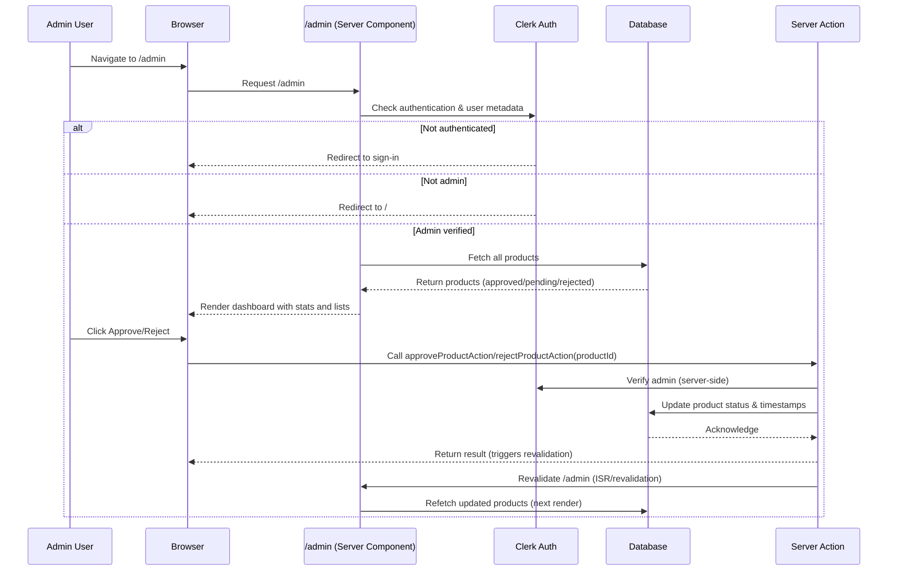

# iBuiltThis

A Product Hunt-style web application for discovering and sharing community-built products. Built with Next.js 16, Clerk authentication, Drizzle ORM, and Neon (PostgreSQL).


## Features

- 🏠 **Landing Page** — Featured products, recently launched, and community highlights
- 🔍 **Explore** — Browse and filter all approved products
- 📝 **Submit** — Authenticated users can submit their products for review
- 🗳️ **Voting** — Upvote products you love
- 🛡️ **Admin Dashboard** — Approve/reject submissions, view stats
- 🔐 **Authentication** — Clerk-powered sign-in/sign-up with organization support

## Tech Stack

| Layer      | Technology                                                 |
| ---------- | ---------------------------------------------------------- |
| Framework  | Next.js 16 (App Router, Server Components, Server Actions) |
| Language   | TypeScript                                                 |
| Styling    | Tailwind CSS 4, shadcn/ui                                  |
| Auth       | Clerk                                                      |
| Database   | Neon (PostgreSQL)                                          |
| ORM        | Drizzle                                                    |
| Deployment | Vercel                                                     |

## Project Structure

```
app/
├── page.tsx              # Landing page
├── explore/              # Browse products
├── products/[slug]/      # Product detail
├── submit/               # Submit new product
└── admin/                # Admin dashboard

components/
├── landing-page/         # Hero, featured, recently launched
├── products/             # Product cards, explorer, voting
├── admin/                # Admin-specific components
├── common/               # Header, footer, section headers
├── forms/                # Form fields
└── ui/                   # shadcn/ui primitives

lib/
├── products/             # Server actions & queries
└── admin/                # Admin actions

db/
├── schema.ts             # Drizzle schema
├── index.ts              # DB connection
└── seed.ts               # Seed data
```

## Getting Started

### Prerequisites

- Node.js 18+ or Bun
- A [Neon](https://neon.tech) database
- A [Clerk](https://clerk.com) application

### Environment Variables

Create a `.env` file in the project root:

```env
DATABASE_URL=postgresql://...@...neon.tech/...?sslmode=require

NEXT_PUBLIC_CLERK_PUBLISHABLE_KEY=pk_...
CLERK_SECRET_KEY=sk_...
NEXT_PUBLIC_CLERK_SIGN_IN_URL=/sign-in
NEXT_PUBLIC_CLERK_SIGN_UP_URL=/sign-up
```

### Installation

```bash
# Install dependencies
bun install

# Push schema to database
bunx drizzle-kit push

# (Optional) Seed the database
bun run db/seed.ts

# Start development server
bun dev
```

Open [http://localhost:3000](http://localhost:3000) in your browser.

### Build for Production

```bash
bun run build
bun start
```

## Admin Dashboard Flow

The admin dashboard is protected by Clerk authentication. Only users with `isAdmin: true` in their public metadata can access it.



## Database Schema

| Column           | Type      | Description                         |
| ---------------- | --------- | ----------------------------------- |
| `id`             | serial    | Primary key                         |
| `name`           | text      | Product name                        |
| `slug`           | text      | URL-friendly identifier             |
| `tagline`        | text      | Short description                   |
| `description`    | text      | Full description                    |
| `websiteUrl`     | text      | Product website                     |
| `tags`           | text[]    | Category tags                       |
| `status`         | enum      | `pending` / `approved` / `rejected` |
| `voteCount`      | integer   | Upvote count                        |
| `submittedBy`    | text      | User email                          |
| `userId`         | text      | Clerk user ID                       |
| `organizationId` | text      | Clerk org ID                        |
| `createdAt`      | timestamp | Submission date                     |
| `approvedAt`     | timestamp | Approval date                       |

## Scripts

| Command                   | Description               |
| ------------------------- | ------------------------- |
| `bun dev`                 | Start development server  |
| `bun build`               | Build for production      |
| `bun start`               | Start production server   |
| `bunx drizzle-kit push`   | Push schema changes to DB |
| `bunx drizzle-kit studio` | Open Drizzle Studio GUI   |

## Deployment

Deploy to [Vercel](https://vercel.com) with one click:

[](https://vercel.com/new/clone?repository-url=https://github.com/shinobiwanshin/ibuiltthis-app)

Set the environment variables in your Vercel project settings.

## Contributing

1. Fork the repository
2. Create a feature branch (`git checkout -b feat/amazing-feature`)
3. Commit your changes (`git commit -m 'Add amazing feature'`)
4. Push to the branch (`git push origin feat/amazing-feature`)
5. Open a Pull Request

## License

MIT — see [LICENSE](LICENSE) for details.
